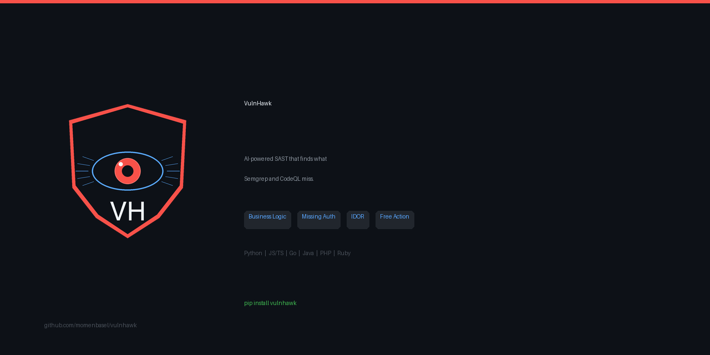
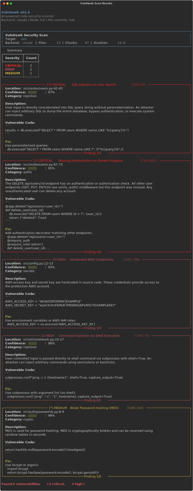

<p align="center">
  
</p>

<p align="center">
  <strong>AI-powered code security scanner that finds vulnerabilities Semgrep and CodeQL miss.</strong>
</p>

<p align="center">
  <a href="https://pypi.org/project/vulnhawk/"></a>&nbsp;
  <a href="https://github.com/marketplace/actions/vulnhawk-security-scan"></a>&nbsp;
  <a href="https://github.com/momenbasel/vulnhawk/blob/main/LICENSE"></a>&nbsp;
  <a href="https://github.com/momenbasel/vulnhawk/stargazers"></a>
</p>

<p align="center">
  <a href="#quick-start">Quick Start</a> &bull;
  <a href="#github-action">GitHub Action</a> &bull;
  <a href="#vulnhawk-vs-other-sast-tools">Comparison</a> &bull;
  <a href="#supported-languages">Languages</a> &bull;
  <a href="#faq">FAQ</a>
</p>

---

## The Problem

Traditional SAST tools rely on pattern matching and AST rules. They excel at catching known vulnerability patterns, but they fundamentally **cannot reason about intent**.

If your API has 20 endpoints and 19 of them verify authorization before acting on a resource, Semgrep has no way to flag the one that doesn't - because there is no pattern to match against. The vulnerability is the *absence* of a pattern.

## The Solution

VulnHawk analyzes code with AI, and for every piece of code it examines, it includes **related code from elsewhere in your codebase** as context. This enrichment step lets the AI compare how similar components handle security - and spot the one that doesn't.

<p align="center">
  
</p>

---

## Quick Start

```bash
pip install vulnhawk
```

Choose a backend:

```bash
# Claude Code CLI - FREE for subscribers (recommended)
vulnhawk scan ./src -b claude-code

# Codex CLI - FREE for ChatGPT Pro/Plus subscribers
vulnhawk scan ./src -b codex

# Claude API
export ANTHROPIC_API_KEY=sk-ant-...
vulnhawk scan ./src

# OpenAI API
vulnhawk scan ./src -b openai -m gpt-4o

# Ollama - free, local, fully private
vulnhawk scan ./src -b ollama -m llama3.1
```

No config files. No rules to write. No database to build.

> **Claude Code and Codex backends are free** for users with existing subscriptions. VulnHawk pipes prompts through your local CLI, so there are no additional API costs.

---

## VulnHawk vs Other SAST Tools

| Capability | VulnHawk | Semgrep | CodeQL | Snyk Code | Checkmarx | SonarQube |
|:---|:---:|:---:|:---:|:---:|:---:|:---:|
| Detection method | AI reasoning | AST patterns | QL data flow | ML + rules | Patterns + flow | Patterns |
| Business logic flaws | **Yes** | No | Limited | Limited | Limited | No |
| Cross-file context | Automatic | Custom rules | Custom queries | Partial | Paid tier | Limited |
| Setup complexity | Zero config | Rule config | DB build + QL | Config file | Complex | Server setup |
| Custom rules required | No | Yes (YAML) | Yes (QL) | Partial | Yes | Yes |
| Context-aware fixes | **Yes** | Generic | Generic | Generic | Generic | Generic |
| Local / private mode | Ollama | Yes | Yes | No | No | Self-hosted |
| CI/CD integration | 1-line Action | Action | Action | Action | Plugin | Plugin |
| SARIF input (chain tools) | **Yes** | No | No | No | No | No |
| Pricing | Free\* | Free / Paid | Free / Paid | Free / $$$ | $$$$$ | Free / $$$ |

<sub>\*Free with Claude Code, Codex CLI, or Ollama. API backends cost ~$0.50-$2.00 per scan.</sub>

### What VulnHawk finds that others cannot

| Vulnerability class | Why rule-based tools miss it |
|:---|:---|
| Missing authorization on 1-of-N endpoints | No pattern to match - the bug is the *absence* of a check |
| IDOR / BOLA | Requires understanding that the user ID in the JWT should match the ID in the URL |
| Payment amount manipulation | Business logic - the amount field shouldn't be trusted from the client |
| Inconsistent input validation | 5 handlers sanitize, the 6th doesn't - needs cross-file comparison |
| Stored input misuse | Input saved safely, but `eval()`'d or raw-SQL'd 3 files away |
| Race conditions in state updates | Concurrent balance modifications without locking |

### Recommended tool combination

VulnHawk is designed as a **complementary layer**, not a replacement:

| Layer | Tool | Purpose |
|:---|:---|:---|
| 1 | **Semgrep** | Fast, deterministic gatekeeping on known-bad patterns |
| 2 | **CodeQL** | Deep taint tracking across complex call chains |
| 3 | **VulnHawk** | Business logic, auth gaps, IDOR, and inconsistencies rules can't express |

---

## Usage

### Scan modes

```bash
vulnhawk scan ./src                      # Full scan (default)
vulnhawk scan ./src --mode auth          # Auth bypass, missing checks, session flaws
vulnhawk scan ./src --mode injection     # SQLi, command injection, SSTI, XSS
vulnhawk scan ./src --mode secrets       # Hardcoded keys, tokens, passwords
vulnhawk scan ./src --mode config        # Debug mode, permissive CORS, insecure cookies
vulnhawk scan ./src --mode crypto        # Weak hashing, hardcoded keys, bad RNG
```

### Output formats

```bash
vulnhawk scan ./src -o json -f results.json        # JSON
vulnhawk scan ./src -o sarif -f results.sarif       # SARIF (GitHub Code Scanning)
vulnhawk scan ./src -o markdown -f report.md        # Markdown report
```

### Severity filter

```bash
vulnhawk scan ./src --severity high      # Critical + High only
vulnhawk scan ./src --severity info      # Everything
```

### SARIF input - chain with other tools

Feed Semgrep, CodeQL, or any SARIF-producing tool's output into VulnHawk. It uses those findings as additional context to **validate, expand, and chain** them into deeper vulnerabilities.

```bash
# Run Semgrep first, then enrich with VulnHawk
semgrep --config auto ./src -o semgrep.sarif --sarif
vulnhawk scan ./src --sarif-input semgrep.sarif
```

What this enables:
- Validates whether other tools' findings are real or false positives
- Discovers related vulnerabilities near flagged locations
- Builds multi-step attack chains connecting findings across tools
- Checks whether suggested fixes address the actual root cause

### Dry run

```bash
vulnhawk info ./src    # Preview files, chunks, and language breakdown
```

---

## GitHub Action

VulnHawk runs as a **baseline scan on your default branch** and **incrementally on every pull request**.

### Recommended setup

```yaml
name: VulnHawk Security Scan
on:
  push:
    branches: [main, master]
  pull_request:

permissions:
  security-events: write
  contents: read

jobs:
  vulnhawk:
    runs-on: ubuntu-latest
    steps:
      - uses: actions/checkout@v4
      - uses: momenbasel/vulnhawk@main
        with:
          target: '.'
          backend: 'claude-code'
          claude-code-oauth-token: ${{ secrets.CLAUDE_CODE_OAUTH_TOKEN }}
          severity: 'medium'
          fail-on-findings: 'true'
```

Findings are automatically uploaded to GitHub's **Security > Code Scanning** tab via SARIF.

### Backend options

<table>
<tr><th>Backend</th><th>Configuration</th></tr>
<tr>
<td><strong>Claude Code</strong> (free)</td>
<td>

```yaml
backend: 'claude-code'
claude-code-oauth-token: ${{ secrets.CLAUDE_CODE_OAUTH_TOKEN }}
```
Get your token: `claude config get oauth_token`
</td>
</tr>
<tr>
<td><strong>Codex</strong> (free)</td>
<td>

```yaml
backend: 'codex'
```
Requires `codex login` on the runner.
</td>
</tr>
<tr>
<td><strong>Claude API</strong></td>
<td>

```yaml
api-key: ${{ secrets.ANTHROPIC_API_KEY }}
```
</td>
</tr>
<tr>
<td><strong>OpenAI API</strong></td>
<td>

```yaml
backend: 'openai'
api-key: ${{ secrets.OPENAI_API_KEY }}
```
</td>
</tr>
</table>

### Chaining with Semgrep in CI

```yaml
steps:
  - uses: actions/checkout@v4

  - name: Semgrep (fast pattern scan)
    uses: returntocorp/semgrep-action@v1
    with:
      config: auto
      generateSarif: true

  - name: VulnHawk (deep AI analysis)
    uses: momenbasel/vulnhawk@main
    with:
      target: '.'
      backend: 'claude-code'
      claude-code-oauth-token: ${{ secrets.CLAUDE_CODE_OAUTH_TOKEN }}
      sarif-input: 'semgrep.sarif'
```

---

## Supported Languages

| Language | Extensions | Framework detection |
|:---|:---|:---|
| Python | `.py` | Django, Flask, FastAPI |
| JavaScript | `.js` `.jsx` | Express, Fastify, Next.js |
| TypeScript | `.ts` `.tsx` | Express, NestJS, Fastify |
| Go | `.go` | net/http handlers |
| Java | `.java` | Class/method splitting |
| PHP | `.php` | Laravel routes, classes, traits, interfaces |
| Ruby | `.rb` `.erb` | Rails routes, classes, modules |

---

## How It Works

```
Codebase ──> Discover ──> Chunk ──> Enrich ──> Analyze ──> Validate ──> Report
                │            │          │           │           │
           Respects      Functions  Related     LLM with    Dedup +
           .gitignore   Classes    code from   security    confidence
           .vulnhawk-   Routes     same dir +  prompts     scoring
           ignore       Modules    auth patterns
```

The **enrichment** step is the core differentiator. For each code chunk, VulnHawk includes:
- Other functions/routes from the same directory
- Auth middleware and guard patterns from across the codebase

This gives the AI the context it needs to identify inconsistencies.

---

## Configuration

### .vulnhawkignore

Exclude paths from scanning (gitignore syntax):

```
generated/
vendor/
third_party/
*.gen.go
```

### Environment variables

| Variable | Description |
|:---|:---|
| `CLAUDE_CODE_OAUTH_TOKEN` | Claude Code CLI authentication (free for subscribers) |
| `ANTHROPIC_API_KEY` | Claude API key |
| `OPENAI_API_KEY` | OpenAI API key |

---

## Cost

| Backend | Per scan (~100 files) | Requirement |
|:---|:---|:---|
| **Claude Code CLI** | **Free** | Claude Code Max or Team subscription |
| **Codex CLI** | **Free** | ChatGPT Pro or Plus subscription |
| Claude API | ~$0.50 - $2.00 | Anthropic API credits |
| OpenAI API | ~$1.00 - $4.00 | OpenAI API credits |
| **Ollama** | **Free** | Local machine with 8GB+ VRAM |

---

## FAQ

<details>
<summary><strong>How does the Claude Code CLI backend work for free?</strong></summary>

Claude Code subscriptions (Max at $100-$200/mo, or Team plans) include unlimited CLI usage. VulnHawk invokes `claude --print` under the hood, piping analysis prompts through your existing subscription. No API key. No per-token billing.
</details>

<details>
<summary><strong>How do I get my OAuth token for CI/CD?</strong></summary>

Run `claude config get oauth_token` on your local machine. Add the output as a GitHub Actions secret named `CLAUDE_CODE_OAUTH_TOKEN`.
</details>

<details>
<summary><strong>Should I run it on every PR or only on main?</strong></summary>

Both. Push-to-main scans establish your security baseline and populate the Security tab. PR scans catch new vulnerabilities before merge. The recommended workflow config handles both triggers.
</details>

<details>
<summary><strong>Is my code sent to an external service?</strong></summary>

Yes - code chunks are sent to the configured LLM provider (Anthropic or OpenAI). For fully private, air-gapped scanning, use the **Ollama** backend which runs entirely on your local machine.
</details>

<details>
<summary><strong>Does it replace Semgrep or CodeQL?</strong></summary>

No. VulnHawk is a complementary layer. Semgrep and CodeQL are excellent at what they do (pattern matching and taint tracking). VulnHawk catches the business logic bugs, auth gaps, and inconsistencies that rules cannot express. Use all three together for the strongest coverage.
</details>

<details>
<summary><strong>Does it support PHP / Laravel and Ruby / Rails?</strong></summary>

Yes. VulnHawk includes framework-aware chunking for both. It detects Laravel `Route::get()` definitions, PHP classes/traits/interfaces, Rails route declarations (`get`, `post`, `resources`), and Ruby classes/modules. It also extracts framework-specific imports (`use`, `require`, `include`).
</details>

<details>
<summary><strong>What is SARIF input?</strong></summary>

You can feed VulnHawk a SARIF file produced by any other scanner (Semgrep, CodeQL, Snyk, etc.). VulnHawk uses those findings as additional context during analysis - validating them, finding related issues nearby, and building multi-step attack chains that connect findings across tools.
</details>

---

## Contributing

See [CONTRIBUTING.md](CONTRIBUTING.md).

```bash
git clone https://github.com/momenbasel/vulnhawk.git
cd vulnhawk
uv venv .venv && source .venv/bin/activate
uv pip install -e ".[dev]"
pytest
```

---

## Support the Project

If VulnHawk is useful to you, consider [sponsoring the project](https://github.com/sponsors/momenbasel) to support continued development.

---

## License

VulnHawk is **source-available** under the [VulnHawk License](LICENSE).

**Free for everyone** - individuals, teams, startups, and enterprises may use VulnHawk at no cost for internal security scanning, provided it is installed from an official distribution channel:

- [GitHub Marketplace](https://github.com/marketplace/actions/vulnhawk-security-scan)
- [PyPI](https://pypi.org/project/vulnhawk/)
- [This repository](https://github.com/momenbasel/vulnhawk)

You may not sell the Software, offer it as a competing service, or redistribute forks as a product. Forks are permitted solely for submitting pull requests back to this repository. See [LICENSE](LICENSE) for full terms.
